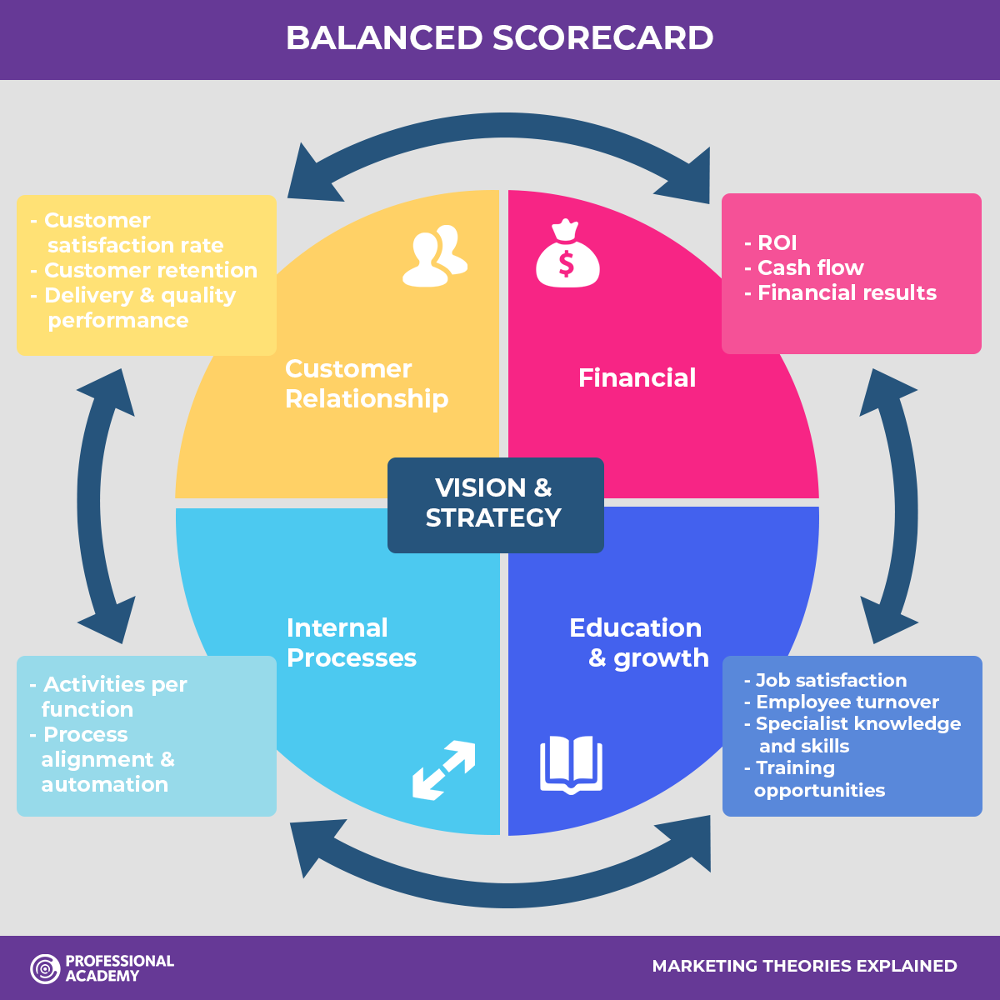

# Harmoniq

## Balanced Scorecard

### Customer Relationship

- Customer satisfaction rates should improve after the implementation of a ticketing system because it will provide a one-stop shop for music-related services for consumers. 
- The new feature will encourage customers to keep using our service to access the music they love and support the Artists they like.
- Given the trust customers already place in our brand, we should endeavour to maintain and enhance this trust by ensuring the new feature is safe, secure, reliable and competitive.

### Financial

- The projected financial performance of the new ticketing feature as highlighted in the Business Case indicates that the initial investment cost is more than justified.
- The forecast Return-on-Investment is favourable for our proposed ticketing solution suggesting the initial outlay in terms of investment for Development will yield positive results.

### Internal Processes

- Given that our proposed solution can be easily implemented as an 'add-on' to existing Artist pages, integration with existing systems should be seamless.
- Ticketing functionality aligns with Harmoniq's vision and strategy to promote Artists.

### Education & Growth

- We will require more specialist knowledge and skills in the live ticketing space but should experience lower employee turnover because of our values as an organisation of nurturing talent at all levels.
- Training opportunities will be provided for current staff in the use of the new ticketing system, further enhancing job satisfaction.
- Because this feature could be seen as an 'add-on', the training required should be at a minimum level, enabling current staff to learn the new system efficiently and effectively. 