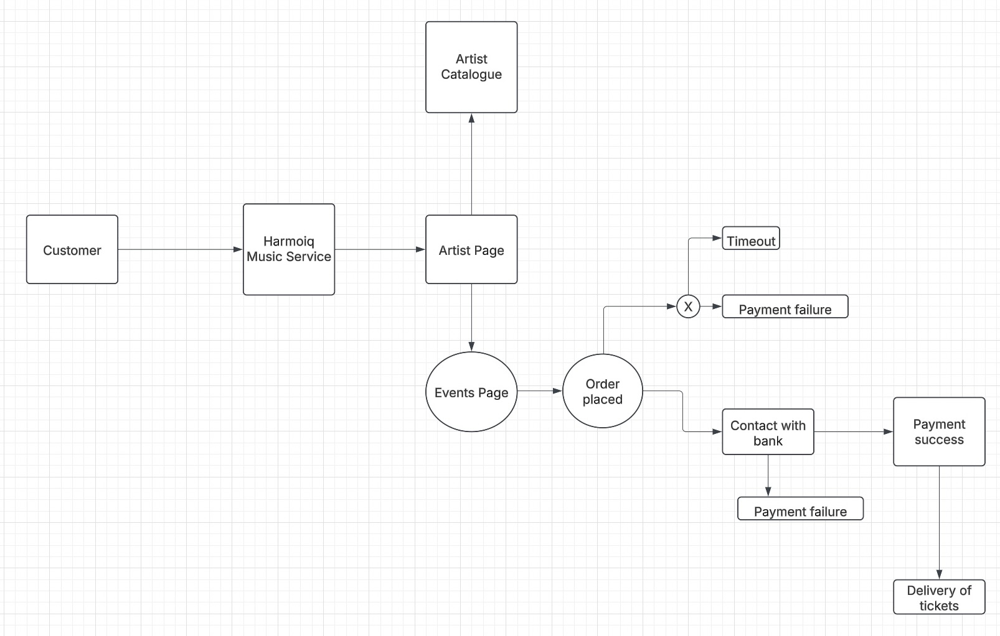

# Harmoniq

## Data Flow Diagram

This simple 0-Level Data Flow Diagram shows the journey a customer would take when purchasing tickets in our application.

Currently, when users access our service, they navigate via the Homepage to their chosen Artist's page which contains the catalogue of music available.

We propose adding a new Events section to the Artist's page which will list current events and ability to order and pay for tickets. 

This ticketing feature will be a self-contained unit of the application which should integrate easily with existing codebases. 

We can use a Feature Toggle function to publish the feature or hide it while it is in Development.