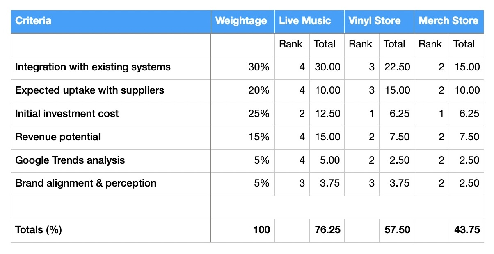

# Harmoniq

## Decision Matrix

1. **Integration with existing systems:**

This criteria is important as it suggests how easy it will be to integrate each proposed solution with our existing codebase and systems. Live Music ranks the highest of the three proposed solutions because we could integrate ticket sales under each of the Artist's pages. 

2. **Expected uptake with suppliers:**

This benchmark is important to ensure suppliers use the new service. Again, Live Music scores most favourably as each artist already has their own page on the Harmoniq service, rather than trying to encourage new suppliers to use an additional e-commerce route via our vinyl or merchandise shopfronts.

3. **Initial investment cost:**

The initial investment cost is a critical criteria to meet as it will affect Harmoniq's growth. We anticipate adding Live Music ticket sales to existing Artist pages to require less initial investment than creating new e-commerce functionality via vinyl or merchandise shopfronts. Because of this, we suggest initial investment to be lower and therefore more favourable for Live Music than the other proposed solutions.

4. **Revenue potential:**

The revenue potential and forecast revenue margins are better for Live Music sales rather than selling products. Competition from online giants such as Amazon means viability for a vinyl or merchandise store is reduced.

5. **Google Trends analysis:**

Given our analysis of Google Trends data (see appendices for details), Live Music scored consistently highly throughout the twelve-month period used. Searches for "vinyl records" and "merchandise" proved to be seasonal in nature which would ultimately affect revenue growth and increase unpredictability. 

6. **Brand alignment & perception:**

Harmoniq is a well-trusted and admired brand because of their preferable revenue sharing with Artists. Any new service or feature must enhance brand perception rather than detract from it. Live Music ticketing aligns with Harmoniq's promotion of talented Artists and allows artists to promote their work in new ways. An e-commerce facility for vinyl records or merchandise could harm the brand's reputation by being perceived primarily as a money-grabbing opportunity.