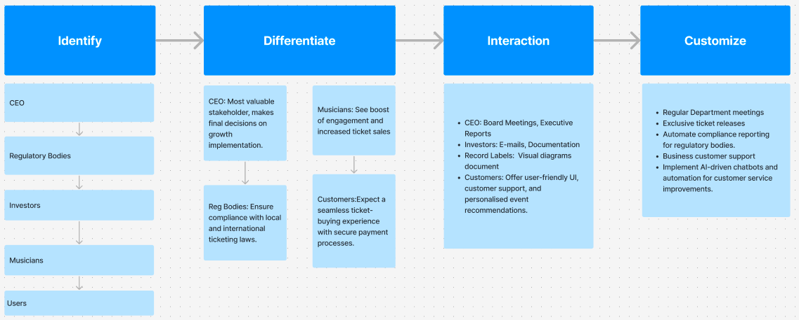

# Harmoniq

## IDIC Model

The IDIC Model (Identify, Differentiate, Interact, Customize) helps in managing relationships with key stakeholders by understanding their needs and tailoring interactions accordingly.
By following this structured process and the IDIC model, the integration of a ticketing feature will enhance user engagement, provide an additional revenue stream, and ensure a secure, seamless experience for all stakeholders.