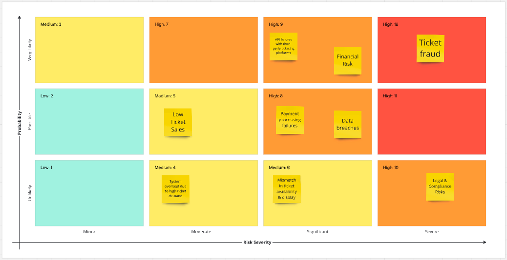

# Harmoniq

## Risk Assessment

The above risk assessment considers the risks with implementing the live music feature. By considering these risks we are able to make a clear assessment as to whether the addition is worth doing, or if mitigations can assist to make the risks manageable.

### Risks and Mitigations
**Ticket Fraud**: This poses as a risk as the purchased tickets could be duplicated and forged.
- Mitigation: By implementing an identity verification feature and generating unique QR codes reduces this risk severely.

**Legal & Compliance**:
- Mitigation: Ensuring app is compliant with consumer protection laws by working with lawyers and rights organisations to manage legal obligations.

**Financial Risks**:
- Mitigation: Implement fraud detection systems and clear refund policies.

**Data Breaches**:
 - Mitigation: Use end-to-end encryption and 2 factor authentication.

**API failures**:
 - Mitigation: Error handling with detailed monitoring, whilst setting a timer for limits on calls within a certain time

**Payment Processing Failures**: 
- Mitigation: Use reliable payment processes such as PayPal

**Mismatch Availability and Display**:
- Mitigation: Regularly reload data with ticket providers to have real-time availability tracking

**Low Ticket Sales**:
- Mitigation: Offer marketing tools and build additional features to boost customer and artist relationships

**System Overload**:
- Mitigation: Implement load testing

The high priority risks need to be addressed to increase feature viability, and my implementing the above mitigations, it reduces all the risks significantly. This leads us to push for the feature adoption, as the benefits are seeming to outweigh the risks.