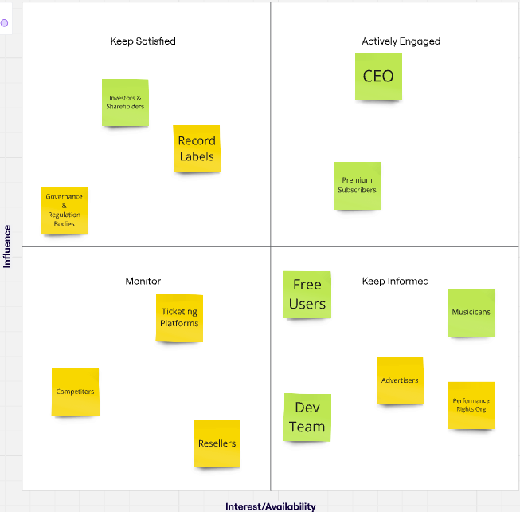

# Harmoniq

## Stakeholder Analysis

The above stakeholder analysis observes the stakeholders for Harmoniq's application currently (green), and those who would become stakeholders after implementation (yellow). The 'Actively Engaged' and 'Keep Satisfied' stakeholders need to be satisfied, otherwise have status to implement their desired changes. This places them quite high in the thought of consideration to implementing change for the goal in branching out into other service lines.

### Stakeholder needs

Premium and Free Users:
- High-quality music streaming
- Affordable subscription plans
- Data privacy & security
- Access to artist concert tickets

Musicians:
- Fair royalties & revenue share
- Wide audience reach & promotion
- Analytics on listener engagement
- Easy music distribution

Performance Rights Organizations(PRO):
- Fair distribution of royalties
- Compliance with copyright laws

Employees & Internal Teams:
- Innovation-driven work environment
- Competitive salaries & benefits
- Clear company vision & career growth opportunities

By implementing the new service of purchasing concert tickets, Users now have motivation to use the app beyond streaming as they have exclusive ticket purchase functionality. The musicians and record label gain an extra revenue stream and a great promotional tool for tours. Whilst investors & shareholders can expect growth from the ticketing business, increasing revenue diversification.
