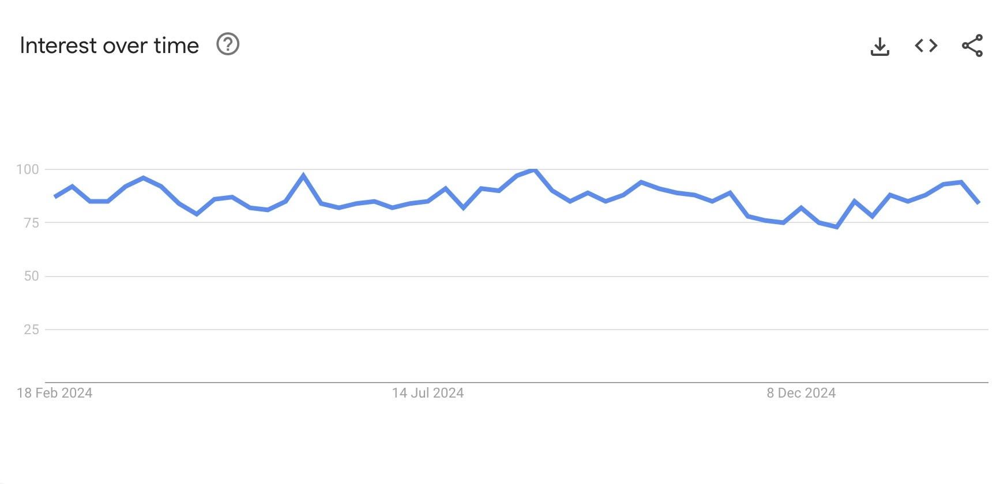
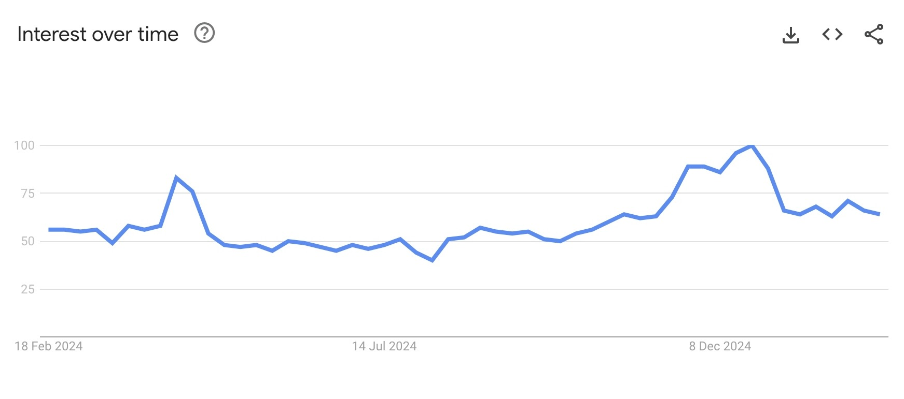
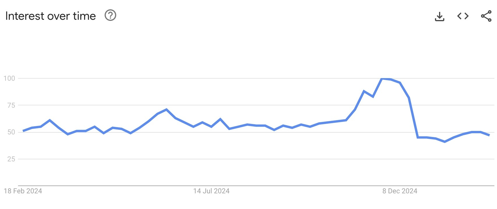

# Harmoniq

## Trends relating to the three proposed solutions

### "Live Music"

The search term "live music" has a stable interest-over-time curve ranging from between 75 and 100. The term has been consistently searched for over the past 12 months.

### "Vinyl Records"

The search term "vinyl records" has a relatively dramatic search curve ranging from 47 to 100 over the course of 12 months. This chart indicates that this search term is seasonal, increasing near and peaking over the Christmas season. This volatility should be taken into account when choosing the solution.

### "Merchandise"

In a similar way to the "vinyl records" search trends chart, "merchandise" seearches seem to be seasonsal, also peaking around the Christmas season before tailing off quite dramatically. Search term interest otherwise seems to remain consistent around the 50 mark. 