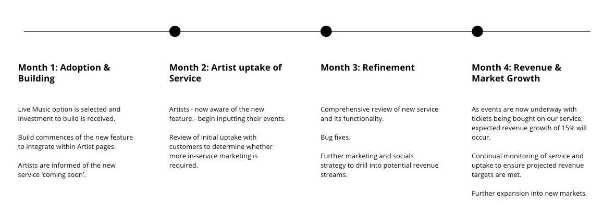

# Harmoniq

## Business Case

### Opportunity

Harmoniq has an opportunity to continue building its already-profitable brand. Our well-known support for artists can be enhanced further by either offering live music ticketing, an online vinyl record store, or online merchandise store.

This business case examines the feasibility, risks and strategic benefits of these three options and recommends the implementation of one of them. 

### Solution

After a thorough analysis of each proposed solution, this business case recommends creating live music ticketing functionality within our already-successful music service due to its alignment with our brand in terms of supporting artists, lower initial investment impact and superior integration with existing systems.

The live music industry is experiencing strong growth, with increased ticket sales and revenue streams. We should support our Artists in this growth and offer them opportunities to use our platform to enhance ticket sales, deepening our brand's values of supporting Artists.

### Approach

Our solution is based on our analysis of several documents (see appendices):

- Stakeholder Analysis to understand the market and the demographics which will affect the outcome of the project.
- Google Trends Analysis to understand more broadly the trends in terms of Google searches for each of the proposed solutions. In turn this provides a forecast for potential revenue streams for each solution.
- Decision Matrix to prioritise which solution is the best fit for Harmoniq. 

### Trends

Drawing from our Trends Appendix (see appendices), searches for "live music" remain consistently high throughout the twelve month period. This suggests that demand for live music events isn't directly related to seasonal trends, offering a consistent and stable revenue opportunity for Harmoniq. Conversely, searches for "vinyl records" and "merchandise" experience strong peaks over the Christmas period and dramatically fall to below the level of "live music" searches thereafter, suggesting a seasonal trend and less stable revenue forecasting ability. 

### Milestones

### Conclusion

